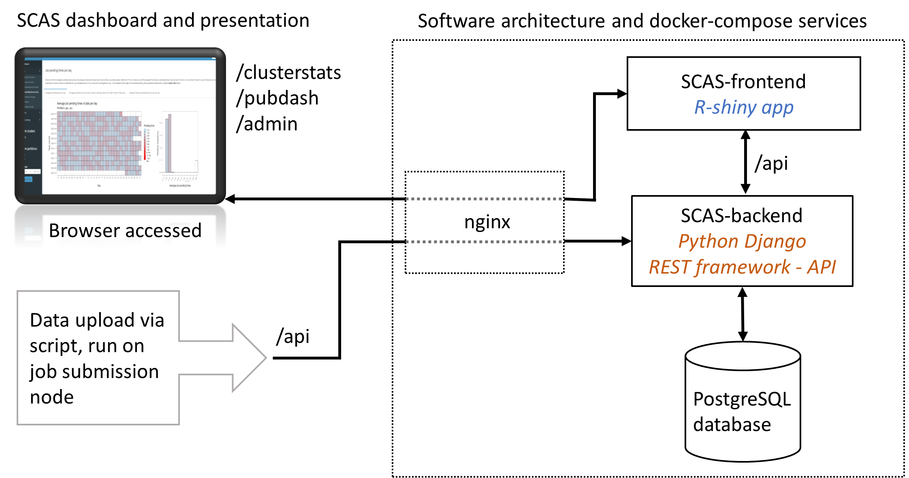
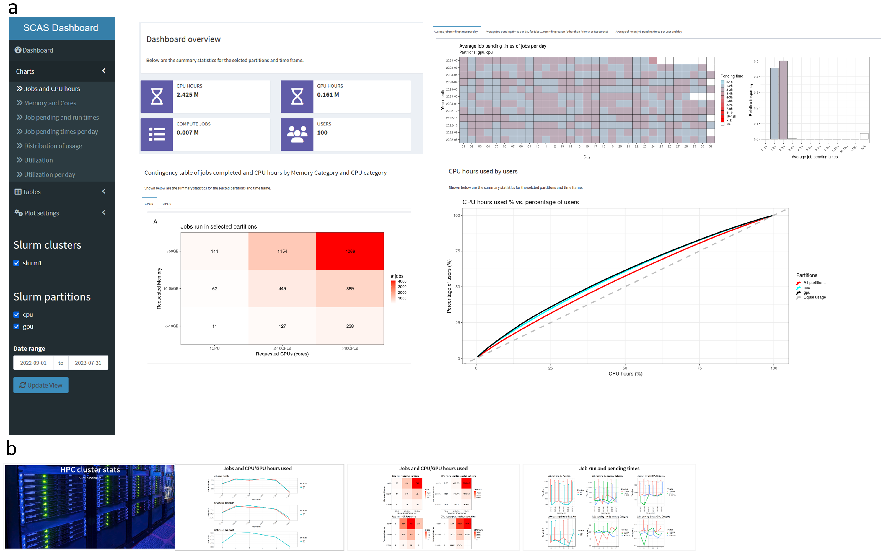

# Slurm Cluster Admin Stats (SCAS) dashboard

The Slurm Cluster Admin Stats (SCAS) dashboard has been developed to analyze the usage statistics of Slurm based HPC clusters.  
It provides various statistics, their visualizations, and insights to the HPC stakeholders and cluster users.  
The software architecture is shown in Figue 1 below.  



*Figure 1: The dashboard and the presentation are accessed by the user through a web browser. New data can be uploaded to the SCAS dashboard by executing a script that regularly fetches the latest data from a job submission node. On the server side the architecture is organized into separate components (shown in dashed box): nginx (reverse proxy), SCAS-frontend, SCAS-backend and PostgresSQL database. A docker-compose implementation of the services is provided.*

## Key features
- Dashboad and presentation of cluster statistics  
- User Admin and Login function for dashboard  
- Data indexing and therefore low memory footprint and responsive frontend  
- Support for multiple clusters    
- Docker-compose based setup provided  

### Key visualizations

For the selected date frame, the visualizations comprise:
- Number of Jobs, CPU and GPU hours per month
- Memory and cores requested by the users, displayed as contingency graphs
- Average job pending and runtimes per month and per day
- Distribution of CPU hours used vs. the percentage of users
- Utilization of the cluster in total and of individual nodes per month and day, summaries of utilization per CPU/GPU or memory type of the nodes per month  

For presentation of the key figures to the cluster users, a presentation that can be run in the browser in carousel mode can be generated (see Figure 2b). 

  
*Figure 2: a. User interface of SCAS Dashboard with the navigation and select menu on the left side, statistics and graphics are displayed in the center panel (here shown are some example visualizations). b. Presentation slides that can be automatically generated to display key statistics and graphs on a screen.*

# Docker-compose based setup

## Prerequisites
Install Docker and docker-compose  
Clone the repository and change to the `docker` directory.  
*Note that depending on the docker-compose installation the syntax of the commands is diferent. For the standalone docker-compose installation the command `docker compose` is `docker-compose`.
For example type `docker-compose up -d` when using compose standalone, instead of `docker compose up -d`.*

## SSL certificate
Per default a self signed certificate is generated.  
To use your own certificate, set SELF_SIGNED_SSL: false in `docker-compose.yml` for the service scas-nginx.  
Bind mount your certicicate (certificate+key in one file) to `/etc/dashboard.pem` for the service scas-nginx.  

## Build and start containers
Build images an run docker-compose to start the containers (nginx, frontend, backend, postgres):  
To build: `docker compose build`   
Run in detached mode: `docker compose up -d`   
Forced rebuild of images: `docker compose build --no-cache`  

**Note:** If you are using a MacBook with Apple Silicon Arm processors you will need to explicity tell
Docker to use the x86 versions of the containers by adding the command
`export DOCKER_DEFAULT_PLATFORM=linux/amd64` before you run any `docker compose` commands.

# Initial setup with test data
This setup is intended for testing and will load the test data.  
```
cd docker
docker exec scas-backend /usr/src/backend/init.sh
docker exec scas-backend python3 manage.py loaddata /scripts/testdata.json
```
This creates the superuser `admin` with password `admin`.  
The default test data was generated from 2022-07 to 2023-08-23  
See [./scripts/Readme.md](./scripts/Readme.md) for further info how to generate test data.  

If tested locally on a laptop, the dashboard is available from: https://localhost/clusterstats/  
The admin area is available from: https://localhost/admin/  
The presentation mode is available from: https://localhost/pubdash/ 

## Delete the test data / database
Go to https://yourserver.edu/admin/ and login with the superuser account (user+password: admin), then go to Jobs, select 1 job and then select "Delete all jobs, Nodes, and YMDdata" from the dropdown.  
Alternative, you can also delete the postgres container and volume:  
*Warning:* This deletes the database volume and the database container, check beforehand the names of your container and volume with `docker ps -a` and `docker volume ls`.   
```
docker compose stop
docker rm scas-postgres
docker volume rm docker_pgdatascas
```

*Important note:* If you use this instance in production, change the password of the `admin` user in https://yourserver.edu/admin/auth/user/.  

# Initial setup for use in production
Database settings can be changed in the file `docker/dashboard.env`  
```
cd docker
docker exec scas-backend /usr/src/backend/init.sh
```
Create a superuser (and password) with:  
```
docker compose run scas-backend python3 manage.py createsuperuser
```

## Create additional users
Go to https://yourserver.edu/admin/ and login with the superuser account that you created, then go to Users to create new users (e.g. a user that is used to upload new data from a submission node).

## App access
The app is accessible from https://yourserver.edu/clusterstats/. Login with a user created in the admin interface (or with the superuser).  

## Public dashboard presentation  
The app can create a [Quarto presentation](https://quarto.org/docs/presentations) that can be run in carousel mode on a screen. It can be accessed from https://yourserver.edu/pubdash, fullscreen mode is possible with key `f` and carousel mode is activated by the play button.  
Settings for the public dashboard are available from the Settings in https://yourserver.edu/admin/  
Per default, the data is generated for the past 6 month, image height is set to 1000px, the page reloads after 12 hours to update the data and plots. The presentation is available without login.  

# Data upload
From the scripts folder, the script `SlurmDashboard_send_data.py` is available to add new data to the app.   
The requirements can be installed with `pip install -r requirements.txt`  
On a cluster login node where the sacct and sinfo commands are available, the following command will send the data from `2021-01-01` to `2021-06-30` to the Dashboard application.  
To authenticate, create a file name `login.conf` (see example file) with username and password.  
This user has to be created using the admin interface.  

```
./SlurmDashboard_send_data.py --apiurl https://yourserver.edu/ --clusterid slurm1 --datestart 2021-01-01 --dateend 2021-06-30  
```
Please note to use a `--clusterid NAME` to assign the jobs to a certain cluster.  
For the initial import of the data, there is a limit for `sacct` export, 6 month periods should work well depending on the number of jobs that were run.  
For regular inputs (e.g. by running as a cron job), the script can be used without `--datestart` and `--dateend` and will per default export  -7 days to today (which will export jobs that ended on the day before today).  
See --help for further options.  

## Exclude partitions
If you want to exclude certain partitions from the dashboard, go to https://yourserver.edu/admin/ --> ExcludePartition  

## API documentation
The backend API documentation is available from https://yourserver.edu/docs/ (application needs to be running) and from [https://bioinformatics-munich.github.io/scas_dashboard_api_documentation](https://bioinformatics-munich.github.io/scas_dashboard_api_documentation).  

## Contributor guidelines  

Thank you for your interest and time contributing to this project.  
Note that all contributions must be complied with the [CODE OF CONDUCT](CODE_OF_CONDUCT.md).  
Contributions are welcome and greatly appreciated! To contribute, please follow the following guidelines:  

### Reporting issues 

* Check that the issue has not already been reported on the [issue tracker](https://github.com/Bioinformatics-Munich/scas_dashboard/issues).  
* Submit an issue on the [issue tracker](https://github.com/Bioinformatics-Munich/scas_dashboard/issues) using the corresponding form.  

### Feature requests  

* Check that the feature request has not already been reported on the [issue tracker](https://github.com/Bioinformatics-Munich/scas_dashboard/issues).  
* Submit a feature request on the [issue tracker](https://github.com/Bioinformatics-Munich/scas_dashboard/issues) using the corresponding form.  

### Contributing  

Any contributions are welcomed. Please see [CONTRIBUTIONS.md](CONTRIBUTIONS.md) for the details.

## License  

SCAS dashboard is provided under the MIT license. See [LICENSE.md](LICENSE.md) file for the full text.
